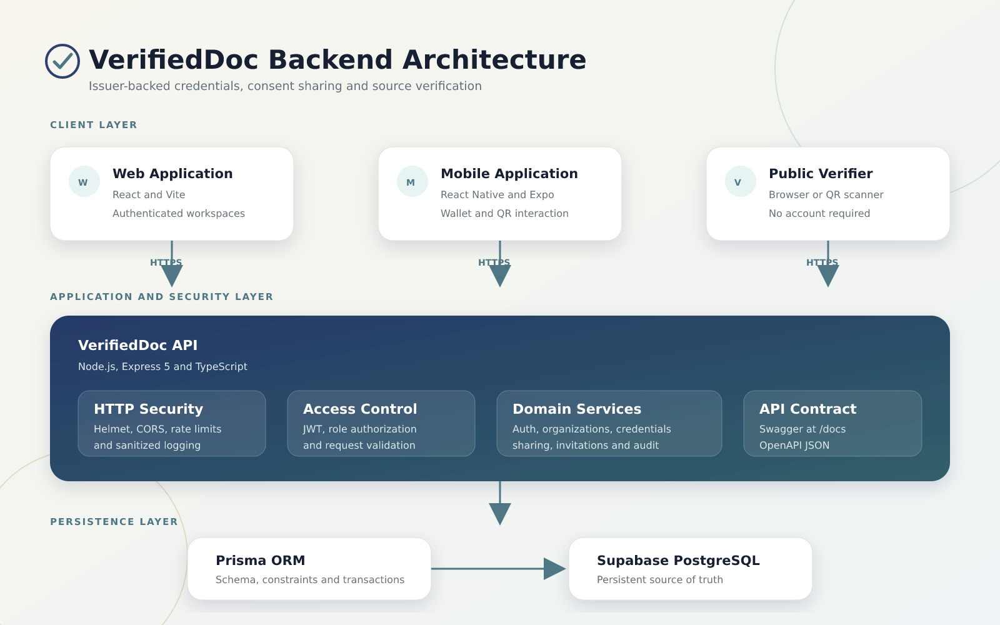

# VerifiedDoc

**Status:** API complete and functional on the `develop` branch. Web client is built and populated on `develop`, with partial live integration to the API.Mobile screens exist on develop across authentication, dashboard, organization, and verifier flows, though several are still stub screens with placeholder content rather than functional features. See MVP Scope below for the full per-client breakdown. Web and mobile are both merged to main, though main currently lags behind develop in mobile screen coverage.

**Release Notes:** See [docs/RELEASE-NOTES-v1.0.md](docs/RELEASE-NOTES-v1.0.md) for the full version history.

VerifiedDoc is an employer and organization credential verification platform. Approved Issuing Organizations create structured credential records for registered Credential Holders. Credential Holders decide what to disclose through limited, consent-based share links. Employers and other Verifiers confirm the live issuer-backed record through a secure link or QR-code scan, then make their own independent decision, replacing phone calls, emails, and manual document review with a single trusted verification step.

VerifiedDoc does not inspect uploaded documents with AI, issue credentials on behalf of institutions, or decide whether a candidate should be hired. The Issuing Organization remains the source of truth.
## The Problem It Solves

| Before VerifiedDoc | After VerifiedDoc |
|---|---|
| Employers and institutions verify credentials through emails, phone calls, and manual document review. | Verifiers confirm a credential through a single secure link or QR-code scan. |
| Credential holders repeatedly resubmit the same documents during job applications and other checks. | Credential holders share a consent-based link once and control who can access it. |
| Documents can be misplaced, altered, or difficult to confirm as authentic. | Issuing Organizations create structured, tamper-resistant credential records as the source of truth. |
| Verification delays reduce confidence in hiring, admissions, and licensing decisions. | Verifiers get an immediate, issuer-backed confirmation and make their own independent decision. |

## Table of Contents

- [The Problem It Solves](#the-problem-it-solves)
- [Core Principles](#core-principles)
- [MVP Scope and Features](#mvp-scope-and-features)
- [User Roles](#user-roles)
- [Technology Stack](#technology-stack)
- - [Architecture Overview](#architecture-overview)
- [Repository Structure](#repository-structure)
- [Developer Instructions](#developer-instructions)
  - [Prerequisites](#prerequisites)
  - [Local Installation and Setup](#local-installation-and-setup)
  - [Environment Variables](#environment-variables)
  - [Expected Outcome](#expected-outcome)
  - [Running the Web and Mobile Apps](#running-the-web-and-mobile-apps)
- [Database Setup and Migrations](#database-setup-and-migrations)
- [Running Tests](#running-tests)
- [Troubleshooting](#troubleshooting)
- [Building on VerifiedDoc](#building-on-verifieddoc)
- [API Documentation](#api-documentation)
- [Live Staging Deployment](#live-staging-deployment)
- [Demo Accounts and Testing Data](#demo-accounts-and-testing-data)
- [Security and Privacy Considerations](#security-and-privacy-considerations)
- [Known Limitations and Open Issues](#known-limitations-and-open-issues)
- [Authentication Flow](#authentication-flow)
- [Contribution Workflow](#contribution-workflow)
- [Team and Contributions](#team-and-contributions)
- [Support](#support)
- [License](#license)

## Core Principles

- The Issuing Organization is the source of truth. Only Platform Administrator-approved organizations may issue credentials.
- Verification relies on structured records, not visual inspection of uploaded files.
- Credential Holders control sharing through consent-based, expiring links.
- Every sensitive action is auditable.
- Platform roles and organization membership roles remain separate.
- Every tenant-scoped query is restricted by organization membership.

## MVP Scope and Features

The API implements the full feature set below. Web client integration varies by feature. The mobile app has screens built across authentication, dashboard, organization, and verifier flows. Screen completeness varies: some screens are wired to live data and hooks, others render placeholder content only. See the table below for the per-feature breakdown.

| Capability | API | Web | Mobile |
|---|---|---|---|
| Registration and login | Complete | Connected (session.js) | Service code exists; Screen exists (stub level, not functional) |
| Platform and organization roles | Complete | Role workspaces | Not present in app |
| Organization application and review | Complete | Demonstration workspace |Screen exists, wired to live data hooks |
| Member invitations and management | Complete | Demonstration workspace | Not present in app |
| Credential issuance and revocation | Complete | Demonstration workspace | Screen exists (stub level, not functional) |
| Holder credential wallet | Complete | Demonstration workspace | Service code exists (api.js); no screen built |
| Consent-based share links | Complete | Demonstration workflow |Service code exists; no screen built |
| Public verification | Complete | Connected | Service code exists (demo.js); Screen exists, but explicitly marked as a placeholder in its own code |
| Organization and platform audit logs | Complete | Demonstration workspace | Not applicable |
| Health, readiness, seed, and admin bootstrap | Complete | Status workspace | Not applicable |

"Demonstration workspace" means the interface exists and can be reviewed, but does not yet perform live write operations against the API. "Connected" means the feature is fully wired to the live API. The mobile app's index.jsx no longer shows Expo's default starter screen; it redirects into the app. Screens exist for login, signup, dashboard, organization, and verification flows, but several are stub screens showing placeholder text only. No wallet screen has been built. Supporting service files (api.js, session.js, demo.js) exist in src/services.

QR-code verification: the Credential Holder generates a QR code from a consent-based sharing link, and the Verifier scans it to confirm the credential. This is implemented and confirmed by Backend as a completed MVP feature at the API level. A verify screen exists on mobile, but it is explicitly marked as a placeholder in its own code and is not yet functional.

**Explicitly excluded from this MVP:**

- Integration with external institutions or third-party verification services (WAEC, NYSC, university, or government systems)
- Automated email notifications
- Password recovery
- Downloadable verification reports and advanced analytics dashboards
- OCR or AI-based document authenticity detection
- Additional credential types beyond the current MVP set
- Production bot protection
- Production app-store signing and release automation

## User Roles

- **Credential Holder:** registers, views, shares, and manages their own credentials. (Usage guide: pending)
- **Verifier:** verifies credential status through a secure link or QR-code scan. (Usage guide: pending)
- **Issuing Organization:** registers, submits for approval, and issues credentials to Credential Holders. (Usage guide: pending)
- **Platform Administrator:** monitors platform activity and approves organizations.

## Technology Stack

- **Web:** React with Vite and TypeScript.Built and populated on develop, and merged to main.`.
- **Mobile:** React Native with Expo (SDK 57, `expo ~57.0.8`) and Expo Router. Project is scaffolded on develop, with screens built across authentication, dashboard, organization, and verifier flows, several still at stub level. Merged to main, though main lags behind develop in screen coverage.
- **API:** Express (Node.js with TypeScript), `express ^5.1.0`.
- **Database:** PostgreSQL, accessed through Prisma (`@prisma/client ^6.12.0`). Nine migrations applied.

- ## Architecture Overview



This diagram reflects the intended architecture and client capabilities. For what is currently built on each client, see MVP Scope and Features above.

## Repository Structure

`apps/api` is the backend API. It contains the Prisma schema, source code, and a test suite of eight files covering authentication, credentials, organizations, invitations, share links, platform operations, and health/logging checks.

`apps/web` is the web client. It is populated on `develop` with a complete Vite/React/TypeScript project and depends on `@verifieddoc/contracts`.

`apps/mobile` is the mobile client. Expo Router project scaffolding exists (_layout.jsx, default index.jsx) along with screens across authentication, dashboard, organization, and verifier flows, several still at stub level, plus service-layer code (src/services/api.js, session.js, demo.js). It does not currently depend on @verifieddoc/contracts.

`apps/mobile-old` is a second, undocumented mobile folder present alongside `apps/mobile`. It contains a full separate project structure of its own: `package.json`, `README.md`, `app.json`, `tsconfig.json`, `.env.example`, `index.js`, `expo-env.d.ts`, a `src` folder, and a single 47KB `App.tsx` file, plus two zero-byte files (`cd`, `code`) that appear to be an accidental commit. Its purpose and disposition are pending confirmation from Backend.

`packages/contracts` contains shared API request and response type definitions. It is currently a dependency of `apps/web` only, not yet used by `apps/api` or `apps/mobile`. Whether mobile is intended to adopt it is pending confirmation from Backend.

`docs` contains `TEAM-HANDOFF.md`, `API-INTEGRATION.md`, `DEMO-SCRIPT.md`, and `FINAL-PRODUCT-HANDOFF.md`, covering team ownership, integration rules, demo guidance, and full product handoff. This folder is distinct from the `/openapi.json` and `/docs` (Swagger UI) API routes described below.

## Developer Instructions

### Prerequisites

- Node.js version 22 or higher.
- Docker and Docker Compose, for running PostgreSQL locally.
- Repository access: public for read access; write access requires an accepted collaborator invite to the `verifieddoc-team` organization.
  
### Local Installation and Setup

1. Clone the repository.
   ```
   git clone https://github.com/verifieddoc-team/verifieddoc-platform.git
   ```
2. Install dependencies.
   ```
   npm install
   ```
3. Create the API environment file.
   ```
   cp apps/api/.env.example apps/api/.env
   ```
4. Create the web environment file.
   ```
   cp apps/web/.env.example apps/web/.env
   ```
5. Create the mobile environment file.
   ```
   cp apps/mobile/.env.example apps/mobile/.env
   ```
6. Start PostgreSQL.
   ```
   docker-compose up -d
   ```
7. Generate the Prisma client.
   ```
   npm run db:generate --workspace=@verifieddoc/api
   ```
8. Apply database migrations.
   ```
   npx prisma migrate deploy --schema=apps/api/prisma/schema.prisma
   ```
9. Start the API.
   ```
   npm run dev:api
   ```

### Environment Variables

Each app (`apps/api`, `apps/web`, `apps/mobile`) has its own `.env.example` file, copied during setup in steps 3 through 5 above. 

[PENDING — the specific variable names and required values inside each `.env.example` file have not been independently confirmed against the actual file contents. This section needs to be completed with the real variable list from Backend before it can be considered reliable. At minimum, this should cover: database connection details for the API, the JWT secret and token expiry settings, and any API base URL the web and mobile clients need to reach the backend.]

Never commit a populated `.env` file to the repository. Confirm each `.env.example` file's actual contents directly before relying on this section.
### Expected Outcome

The API runs at `http://localhost:4000`. The health check responds at `/api/v1/health`. Step 9 starts the API only.

### Running the Web and Mobile Apps

Run each client in its own terminal, separate from the API.

10. Start the web client.
    ```
    npm run dev:web
    ```
11. Start the mobile client.
    ```
    npm run dev:mobile
    ```

Note: the mobile app now launches into the app itself rather than Expo's default starter screen, though several screens still show placeholder content only.

## Database Setup and Migrations

`docker-compose.yml` starts PostgreSQL only; it does not start the API. Nine migrations are applied through the command in step 8 above. Demo data can be seeded separately (see Demo Accounts and Testing Data, below).

## Running Tests

```
npm test
```

This runs the test suite across all workspaces. The API test suite (eight test files) requires PostgreSQL to be running.

## Troubleshooting

- If `npm install` fails, confirm your Node.js version is 22 or higher: `node --version`.
- If `npm run dev:api` does not start, confirm `apps/api/.env` was created from `apps/api/.env.example`.
- If the API cannot reach the database, confirm `docker-compose up -d` is running and healthy (`docker-compose ps`).

## Building on VerifiedDoc

1. Create a GitHub issue with acceptance criteria before starting work.
2. Branch from `develop` using the pattern `feature/<issue>-<short-name>`, `fix/<issue>-<short-name>`, or `docs/<issue>-<short-name>`.
3. Keep commits small, using messages such as `feat(api): add credential issuance`.
4. Open a pull request into `develop` and link the issue.
5. Obtain at least one review and pass automated checks.
6. Squash-merge after approval.

Never commit credentials, access tokens, production data, or real identity documents.

## API Documentation

The API publishes a full OpenAPI 3.1 contract at `/openapi.json`, covering authentication, organizations, credentials, share links, invitations, platform administration, and public verification. An interactive, browsable version of the same contract is available at `/docs` through Swagger UI. Client applications should integrate against this contract rather than duplicating backend types manually. Contract changes must go through a backend pull request, be reviewed by affected client teams, and be announced before merging.

## Live Staging Deployment

Railway hosts the current staging deployment of the VerifiedDoc API. Deployment ownership sits with the Backend Engineering Lead. Full Railway configuration and ownership notes are in [docs/RAILWAY-DEPLOYMENT.md](docs/RAILWAY-DEPLOYMENT.md).

| Item | Value |
|---|---|
| Hosting provider | Railway |
| Environment | Staging |
| Deployment owner | Backend Engineering Lead |
| API base | `https://verifieddoc-platform-production.up.railway.app/api/v1` |
| Health | `https://verifieddoc-platform-production.up.railway.app/api/v1/health` |
| Readiness | `https://verifieddoc-platform-production.up.railway.app/api/v1/ready` |
| Swagger | `https://verifieddoc-platform-production.up.railway.app/docs` |
| OpenAPI | `https://verifieddoc-platform-production.up.railway.app/openapi.json` |

`GET /` returns `NOT_FOUND` intentionally. VerifiedDoc exposes an API surface only; no root webpage route is defined on the API service.
## Demo Accounts and Testing Data

Fictional accounts and credentials (active, expired, and revoked) are created through a gated seed script. Seeding requires `ALLOW_DEMO_SEED=true` and a `DEMO_PASSWORD` value to be set in the environment; passwords and hashes are never printed to the console. Do not use real credentials, personal information, or organization records for testing. (Pending: actual login details to be shared once public deployment is live.)

## Security and Privacy Considerations

The system's code confirms the following rules:

1. Platform roles and organization membership roles are stored separately.
2. Every tenant-scoped query is restricted by organization membership.
3. Raw refresh, share, and invitation tokens are shown only when required and are stored hashed.
4. Public verification returns only holder-approved fields.
5. Unknown, expired, revoked, and exhausted links return a generic unavailable response.
6. Passwords, tokens, hashes, cookies, and authorization headers never enter logs or audit responses.
7. Issuance, revocation, organization review, invitations, and member changes remain auditable.
8. Development and demonstrations use fictional `@example.test` data only.

Two additional rules are stated in project documentation but could not be independently confirmed from application code, and need direct confirmation from Backend:

- That only approved organizations can issue credentials.
- That applied database migrations are never edited after the fact.

Authentication uses JWT (`jsonwebtoken`), password hashing uses `bcryptjs`, request security headers use `helmet`, and rate limiting uses `express-rate-limit`.

## Known Limitations and Open Issues

- apps/web is built and populated on develop, and merged to main. apps/mobile has screens built across several flows, though many remain stub-level, and is also merged to main, though main lags behind develop. Public deployment is not yet live.
- Most operational features in the web client (organization review, invitations, credential issuance, audit logs) run in a demonstration workspace rather than connecting live to the API. Only registration/login, public verification, and system status are fully connected.
- The mobile app has screens for login, dashboard, organization, and verification flows, but many are stub-level with placeholder content only. No wallet or share-link screen exists yet.
- `packages/contracts` is currently used only by `apps/web`. Whether `apps/api` and `apps/mobile` are intended to adopt it is pending confirmation from Backend.
- `apps/mobile-old` exists alongside `apps/mobile` as a full, separate, undocumented project. Disposition pending confirmation from Backend.
- `CONTRIBUTING.md` does not yet reflect the `npm run validate` step or the `develop`-to-`main` promotion step described elsewhere in project documentation.
- External institution and third-party verification integration is not yet supported.
- Automated email notifications are not yet implemented.
- Password recovery is not yet available.
- Downloadable verification reports and advanced analytics dashboards are not yet available.

## Authentication Flow

Credential Holders and Issuing Organizations register and log in through the API's authentication endpoints. On successful login, the API issues a JWT, which the client stores and includes as a Bearer token in the `Authorization` header on subsequent requests.

On the web client, this flow is fully connected to the live API (see `session.js`). 
On mobile, a login screen exists, but it is stub-level and not yet wired to the live API, so the flow is not currently functional on that client.
Public credential verification does not require a Bearer token or user registration of any kind. A Verifier can confirm a credential directly through a secure link or QR-code scan.

For the exact authentication endpoints, request formats, and token payloads, see the OpenAPI contract at `/openapi.json` or the interactive Swagger UI at `/docs`. This README does not duplicate that endpoint list, since the live contract is the authoritative source and won't drift out of sync the way a manually maintained table can.
## Contribution Workflow

See Building on VerifiedDoc, above, and `CONTRIBUTING.md` for full details.

## Team and Contributions

Project Management Team – Project coordination, planning, documentation, stakeholder communication
Product Management Team – Product research, PRD, backlog, sprint planning, feature prioritization, UAT, go-to-market strategy
Product Design Team – User research support, user flows, wireframes, UI design, prototype
Backend Team – API development, database, business logic, authentication
Frontend Team – Web application interface implementation
Mobile Development Team – Mobile application implementation
Technical Writing Team – User guides, README, release notes, product documentation
## Support

Contact: VerifiedDoc Support Team. This is a capstone project without a live support channel.

## License

No LICENSE file is included in this repository. This is intentional for the capstone project.
