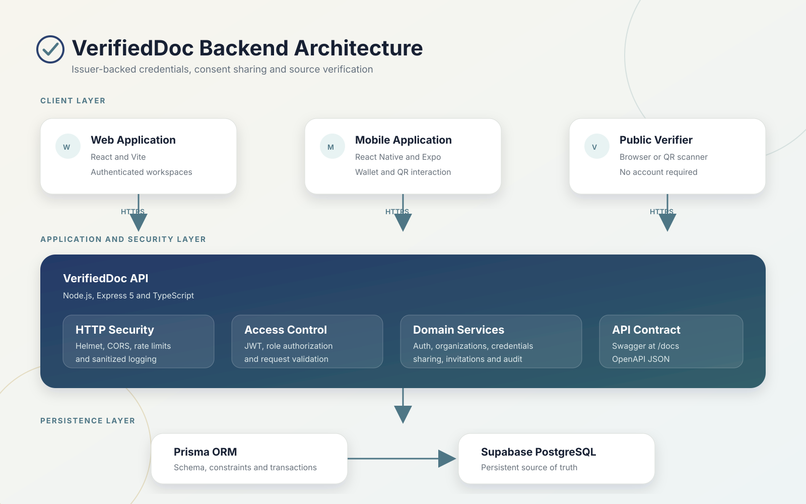
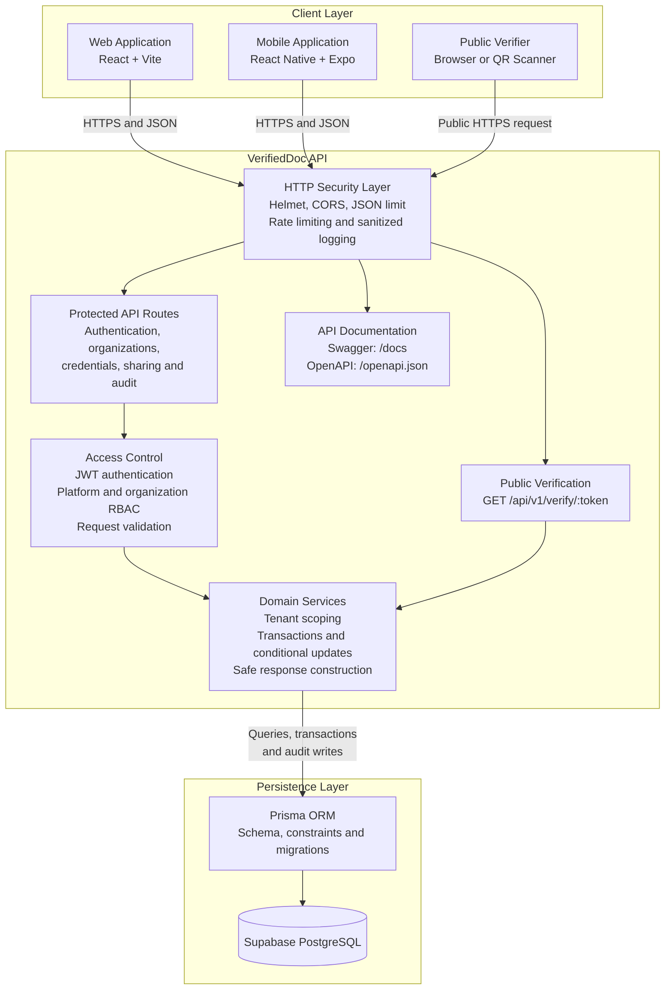
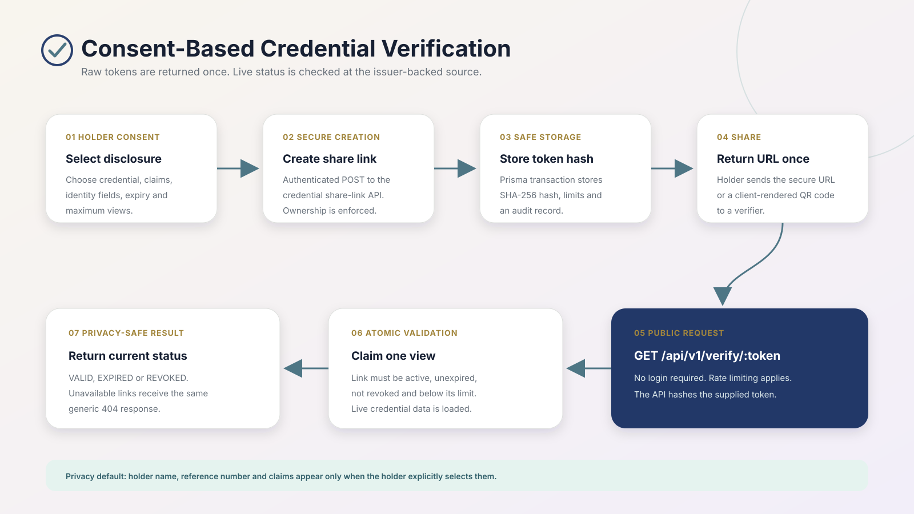
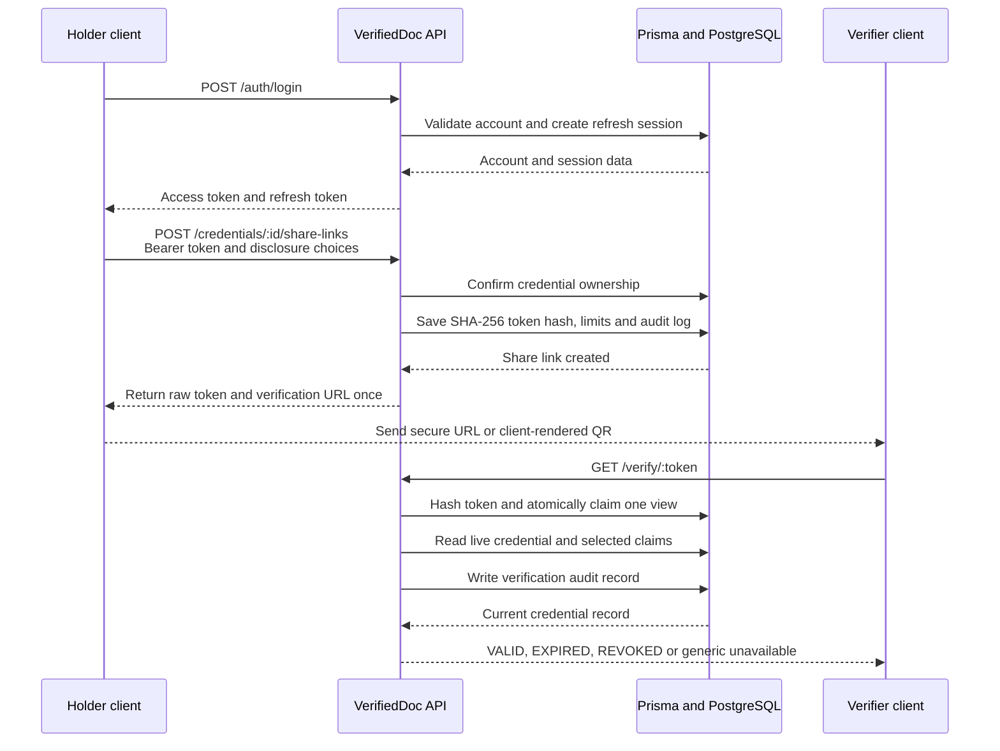

# VerifiedDoc Backend Architecture and API Flow

Verified against the `develop` branch on 3 August 2026.

## Downloadable diagrams

- Backend architecture: [SVG](images/verifieddoc-backend-architecture.svg) | [PNG](images/verifieddoc-backend-architecture.png)
- Credential sharing and verification flow: [SVG](images/verifieddoc-verification-flow.svg) | [PNG](images/verifieddoc-verification-flow.png)

The SVG files are suitable for the repository README, technical documentation, presentations, Google Drive and Figma imports. They remain sharp when resized.

## Backend architecture

## Credential sharing and verification flow

## Verified API groups

| Area | Base endpoints | Access |
| --- | --- | --- |
| System | `GET /api/v1/health`, `GET /api/v1/ready` | Public |
| Authentication | `/api/v1/auth/*` | Public or authenticated, depending on route |
| Organizations | `/api/v1/organizations/*` | Authenticated and tenant scoped |
| Platform review | `/api/v1/admin/organizations/*` | Platform administrator |
| Members and invitations | `/api/v1/organizations/:organizationId/members/*`, `/invitations/*` | Organization administrator or invitee |
| Credential lifecycle | `/api/v1/organizations/:organizationId/credentials/*`, `/api/v1/credentials/*` | Organization member or holder |
| Consent sharing | `/api/v1/credentials/:credentialId/share-links/*` | Credential holder |
| Public verification | `GET /api/v1/verify/:token` | Public and rate limited |
| Audit access | `/api/v1/organizations/:organizationId/audit-logs`, `/api/v1/admin/audit-logs` | Organization or platform administrator |
| API documentation | `/docs`, `/openapi.json` | Public documentation |

## Security boundaries

- Web and mobile clients communicate with the Express API. They do not connect directly to PostgreSQL or Supabase.
- Passwords are stored as bcrypt hashes.
- Access uses short-lived JWT access tokens and rotating refresh tokens.
- Platform roles and organization membership roles are separate.
- Credential, organization and member operations are tenant scoped.
- Share and invitation tokens are stored as SHA-256 hashes.
- The raw share token is returned only when the link is created.
- Verification view consumption is atomic.
- Holder name, reference number and claims are disclosed only when the holder selects them.
- Invalid, expired, revoked and exhausted links return the same generic unavailable response.
- Sensitive headers and verification tokens are redacted from application logs.
- Important operations create audit records.

## QR clarification

The backend returns a secure verification URL. The web or mobile client may render that URL as a QR code. The QR code transports the URL. It does not perform OCR, document scanning or authenticity detection.

## MVP exclusions

The architecture must not show OCR, AI fraud detection, external institution integrations, automated email delivery or downloadable verification reports as completed MVP functionality.
