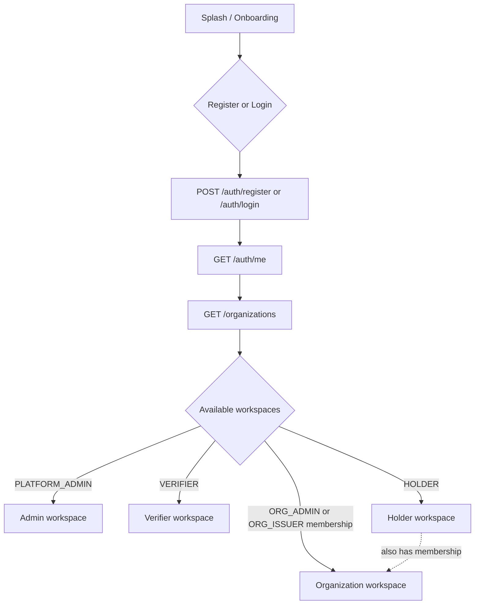
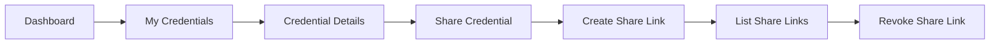
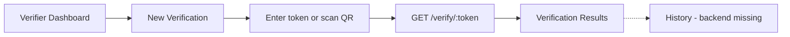
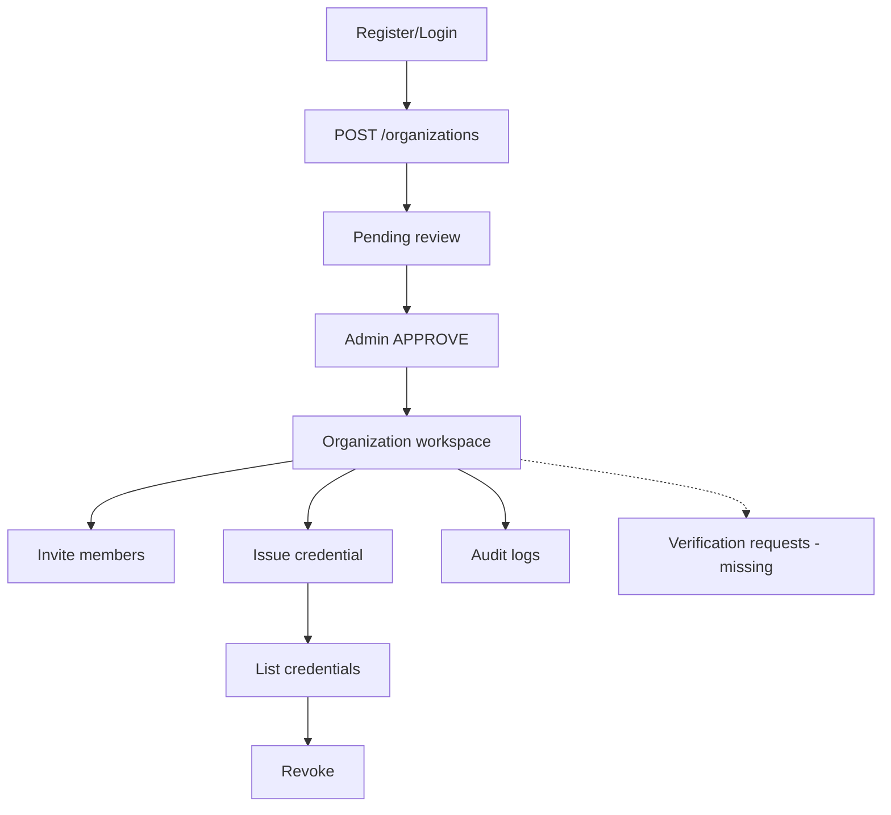

# VerifiedDoc — Figma-Derived User Flow

**Figma file:** [VerifiedDoc — Centralized Digital Document Verification Platform](https://www.figma.com/design/QfOpHB1N0hJNz0g74uEu59/VerifiedDoc---Centralized-Digital-Document-Verification-Platform)  
**Platform Admin dashboard node:** `862:1023`  
**Branch context:** `fix/frontend-api-contract-alignment`  
**Date:** 2026-08-05

## How this flow was produced

Cursor could not authenticate directly to Figma. This flow was produced from a separately verified Figma screen inventory supplied during review. The Figma file contains the relevant screens but has no configured prototype interaction links.

Navigation below was **logically derived** from that screen inventory: navigation labels, dashboard cards, tables, buttons, statuses, and result screens — not from Figma prototype edges. Admin dashboard node referenced: `862:1023`.

**Important:** Frontend route paths listed here are **UI routes only**. Do not create matching backend `/api/v1/...` paths merely because a frontend route exists. API paths are documented separately and must match Express registrations.

Related docs:

- `docs/API-CONTRACT-AUDIT.md` — contract matrix and gap status
- `docs/FRONTEND-API-CONTRACT.md` — client integration contract

---

## 1. Global authentication and workspace resolution

```text
Splash / Onboarding
  → Register or Login
  → GET /auth/me
  → GET /organizations
  → resolve available workspaces
```

### Workspace rules

| Condition | Workspace |
| --- | --- |
| `PlatformRole = PLATFORM_ADMIN` | Admin workspace |
| Organization membership with `ORGANIZATION_ADMIN` or `ORGANIZATION_ISSUER` | Organization workspace |
| `PlatformRole = VERIFIER` | Verifier workspace |
| `PlatformRole = HOLDER` | Holder workspace |

Additional rules:

- A platform `HOLDER` may also have organization memberships.
- **Do not** determine organization access from `PlatformRole` alone.
- Support **multiple available workspaces** without losing Holder access (user can switch; default post-login route may prefer platform role while org workspace remains reachable).

Canonical APIs for this step:

| Step | API |
| --- | --- |
| Register | `POST /auth/register` |
| Login | `POST /auth/login` |
| Refresh / logout | `POST /auth/refresh`, `POST /auth/logout` |
| Current user | `GET /auth/me` |
| Memberships | `GET /organizations` |

---

## 2. Screen → frontend route matrix

These are **frontend page routes only**.

### Authentication

| Figma / flow screen | Frontend route |
| --- | --- |
| Login | `/login` |
| Register | `/register` |
| Forgot Password | `/forgot-password` |
| Verify OTP | `/verify-otp` |
| Create New Password / Reset Password | `/reset-password` |
| Password Updated | `/password-updated` |

### Holder

| Figma / flow screen | Frontend route |
| --- | --- |
| Holder Dashboard | `/holder/dashboard` |
| My Credentials | `/holder/credentials` |
| Credential Details | `/holder/credentials/:credentialId` |
| Share Credential | `/holder/share` |
| Activity | `/holder/activity` |
| Settings | `/holder/settings` |

### Verifier

| Figma / flow screen | Frontend route |
| --- | --- |
| Verifier Dashboard | `/verifier/dashboard` |
| New Verification | `/verifier/verify` |
| Verification Results | `/verifier/results` |
| Verification History | `/verifier/history` |
| Saved Organizations | `/verifier/saved-organizations` |
| Settings | `/verifier/settings` |

### Organization (Issuing Organization)

| Figma / flow screen | Frontend route |
| --- | --- |
| Organization Dashboard | `/organization/dashboard` |
| Issue Credential | `/organization/credentials/new` |
| Issued Credentials | `/organization/credentials` |
| Verification Requests | `/organization/verification-requests` |
| Organization Profile | `/organization/profile` |

### Platform Admin

| Figma / flow screen | Frontend route |
| --- | --- |
| Admin Dashboard (node `862:1023`) | `/admin/dashboard` |
| Organization Approvals | `/admin/organization-approvals` |
| Organization Management | `/admin/organizations` |
| Platform Activity Monitoring | `/admin/activity` |
| Fraud Alerts | `/admin/fraud-alerts` |
| Reports | `/admin/reports` |

**Note:** Current web app still uses coarser routes such as `/auth`, `/app/holder`, `/app/organization`, `/app/verifier`, `/app/admin`. The table above is the **target Figma-aligned frontend route map**, not a claim that those paths are already implemented.

---

## 3. Screen → API matrix

### Global auth

| Screen / action | Frontend route | Backend API | Status |
| --- | --- | --- | --- |
| Register | `/register` | `POST /auth/register` | Existing |
| Login | `/login` | `POST /auth/login` | Existing |
| Session restore / profile | (after auth) | `GET /auth/me` | Existing (client exists; not always wired) |
| Resolve workspaces | (after auth) | `GET /organizations` | Existing |
| Refresh | — | `POST /auth/refresh` | Existing (no auto-refresh wired) |
| Logout | — | `POST /auth/logout` | Existing |
| Forgot password → OTP → reset → Password Updated | `/forgot-password` … `/password-updated` | *(none)* | **Backend missing** |

### Holder

| Screen / action | Frontend route | Backend API | Status |
| --- | --- | --- | --- |
| Dashboard | `/holder/dashboard` | `GET /holder/dashboard` | Existing — **partial shape vs Figma** |
| My Credentials | `/holder/credentials` | `GET /credentials` | Existing |
| Credential Details | `/holder/credentials/:id` | `GET /credentials/:credentialId` | Existing |
| Create Share Link | `/holder/share` | `POST /credentials/:credentialId/share-links` | Existing |
| List Share Links | `/holder/share` | `GET /credentials/:credentialId/share-links` | Existing |
| Revoke Share Link | `/holder/share` | `PATCH /credentials/:credentialId/share-links/:shareLinkId/revoke` | Existing |
| Activity | `/holder/activity` | *(none)* | **Backend missing** |
| Settings / profile | `/holder/settings` | `GET /auth/me` (read); no profile update API | Partial |
| Holder upload credential | (upload UI if present) | *(none)* | **Product decision** — conflicts with issuer-controlled trust |

**Figma dashboard expects:** total credentials, pending verifications, shared this month, recent credentials, recent activity.  
**Current API returns:** `stats.total|active|expired|revoked` + `recentCredentials`.  
Never map `active`/`expired`/`revoked` onto unsupported Figma labels. Never fabricate pending / shared-this-month / activity.

### Verifier

| Screen / action | Frontend route | Backend API | Status |
| --- | --- | --- | --- |
| Dashboard | `/verifier/dashboard` | *(none)* | **Backend missing** |
| New Verification (token / QR) | `/verifier/verify` | `GET /verify/:token` | Existing |
| Verification Results | `/verifier/results` | `GET /verify/:token` (one-shot) | Existing for single result; no result store |
| Verification History | `/verifier/history` | *(none)* | **Backend missing** |
| Saved Organizations | `/verifier/saved-organizations` | *(none)* | **Backend missing** |
| Settings | `/verifier/settings` | `GET /auth/me` | Partial |
| Credential-ID search | — | *(none)* | **Backend missing** |
| Uploaded-file verification | — | *(none)* | **Backend missing** / unsupported without storage design |

QR codes must encode the same secure verification URL/token used by `GET /verify/:token`.

**Design flag:** Verifier dashboard card “Total Credentials Issued” is inconsistent for a verifier; likely should be “Total Verifications” (PM approval required).

### Organization

| Screen / action | Frontend route | Backend API | Status |
| --- | --- | --- | --- |
| Submit organization | (apply) | `POST /organizations` | Existing |
| List / get membership | — | `GET /organizations`, `GET /organizations/:organizationId` | Existing |
| Pending review → admin approval | Admin approvals | Admin review APIs | Existing (admin side) |
| Invite members | (members/invites UI) | `POST/GET .../invitations`, `PATCH .../invitations/:id/revoke` | Existing |
| Accept invitation | `/invitations/accept` (current web) | `POST /invitations/accept` | Existing |
| Issue credential | `/organization/credentials/new` | `POST /organizations/:organizationId/credentials` | Existing |
| View issued credentials | `/organization/credentials` | `GET /organizations/:organizationId/credentials` | Existing |
| Revoke credential | `/organization/credentials` | `PATCH .../credentials/:credentialId/revoke` | Existing |
| Audit history | (audit UI) | `GET /organizations/:organizationId/audit-logs` | Existing |
| Organization dashboard aggregates | `/organization/dashboard` | *(none)* | **Backend missing** |
| Active recipient count | dashboard | *(none)* | **Backend missing** |
| Verification request queue / approve-deny | `/organization/verification-requests` | *(none)* | **Backend missing** |
| Registration document uploads | apply flow | *(none)* | **Backend missing** — do not implement without storage design |
| Monthly issuance trends | dashboard | *(none)* | **Backend missing** |

### Platform Admin (node `862:1023`)

Figma Admin dashboard contains: Total Users, Institutions, Documents, Verifications, monthly percentage changes, Recent Verification Requests, Fraud Alerts, Quick Actions, notifications, administrator profile.

| Screen / action | Frontend route | Backend API | Status |
| --- | --- | --- | --- |
| Admin login | `/login` | `POST /auth/login` | Existing (role must be `PLATFORM_ADMIN`) |
| Dashboard aggregates | `/admin/dashboard` | *(none)* | **Backend missing** |
| Organization Approvals | `/admin/organization-approvals` | `GET /admin/organizations`, `PATCH .../review` | Existing |
| Organization Management | `/admin/organizations` | Partial via list/review only | **Partial** |
| Platform Activity | `/admin/activity` | `GET /admin/audit-logs` | Partial (audit ≠ full activity product) |
| Fraud Alerts | `/admin/fraud-alerts` | *(none)* | **Backend missing** |
| Reports | `/admin/reports` | *(none)* | **Backend missing** |
| User management | — | *(none)* | **Backend missing** |
| Notifications | — | *(none)* | **Backend missing** |

Treat repeated Quick Action labels “Verified Today” as unfinished design placeholders, not API fields.  
Flag “Verified At” column as inconsistent for Pending/Rejected rows; recommend Updated At, Reviewed At, or Requested At.

---

## 4. Existing functionality

Backend + contracts support today (canonical `/api/v1` prefix omitted below):

- Auth: register, login, refresh, logout, me  
- Holder: dashboard (stats total/active/expired/revoked + recentCredentials), wallet list, credential detail, share-link create/list/revoke  
- Public verify: `GET /verify/:token`  
- Organizations: create, list memberships, get, members, invitations (+ accept/revoke), issue/list/revoke credentials, org audit logs  
- Admin: list organizations, review (`APPROVE`/`REJECT`), platform audit logs  

Web live mode (`VITE_DEMO_MODE=false`) wires many of these; mobile clients are largely **implemented but not wired**.

---

## 5. Partially supported functionality

| Area | Why partial |
| --- | --- |
| Holder dashboard vs Figma | API has active/expired/revoked + recentCredentials; Figma wants pending verifications, shared this month, recent activity |
| Holder settings | Read via session/`/auth/me`; no profile-update API |
| Verifier verify → results | One-shot `GET /verify/:token` works; no persisted results/history |
| Org “dashboard” | Credential/member/invite counts can be derived client-side from list endpoints; no official aggregate API |
| Admin activity | Audit logs exist; not a full monitoring/analytics dashboard |
| Admin org management | Approvals/review exist; not full lifecycle/management suite |
| Multi-workspace UX | Membership-aware access exists on web; Figma-aligned route tree and workspace picker not fully built |
| Password recovery UI | Screens exist in Figma/mobile nav; no backend |

---

## 6. Backend endpoints missing

| Capability | Suggested future direction (not implemented) |
| --- | --- |
| Password recovery / OTP / reset | Secure reset/OTP endpoints (see constraints below) |
| Holder activity feed | Holder activity/read model |
| Holder shared-this-month / pending verifications | Aggregates only from real ShareLink / verification-request data |
| Verifier dashboard | `GET /verifier/dashboard` (or equivalent) |
| Verifier history | Authenticated verification history list/detail |
| Verifier saved organizations | CRUD for saved orgs |
| Verifier credential-ID search | Privacy-reviewed search (often rejected in favor of share tokens) |
| Org dashboard aggregation | `GET /organizations/:id/dashboard` |
| Org verification-request queue + approve/deny | Request lifecycle endpoints |
| Org registration uploads | Upload + metadata APIs **only after** storage design |
| Admin dashboard aggregation | `GET /admin/dashboard` |
| Admin user management | User admin APIs |
| Admin fraud alerts / reports / notifications | Alert/report/notification APIs |

---

## 7. Database models missing

| Model / concept | Needed for |
| --- | --- |
| PasswordResetToken / OtpChallenge | Forgot-password flow |
| VerificationEvent (or equivalent) | Verifier stats, history, admin verification monitoring |
| VerificationRequest | Org request queue; admin “Recent Verification Requests” |
| SavedOrganization | Verifier saved orgs |
| FraudAlert | Admin fraud alerts |
| Report / AnalyticsSnapshot | Admin reports & monthly % changes |
| Notification | Admin/holder notifications |
| DocumentMetadata + storage refs | Registration evidence / uploads |
| HolderActivity (or audit projection) | Holder activity screen |

Existing models remain: `User`, `RefreshToken`, `Organization`, `OrganizationMember`, `OrganizationInvitation`, `Credential`, `ShareLink`, `AuditLog`.

---

## 8. Design / PM decisions required

1. **Brand naming:** Product is VerifiedDoc; several screens show **VerifyDoc** — pick one.  
2. **Dashboard count:** PM materials say three primary dashboards but list four (Holder, Verifier, Organization, Admin).  
3. **Verifier metric label:** “Total Credentials Issued” → likely “Total Verifications” (PM approval).  
4. **Admin Quick Actions:** All say “Verified Today” — unfinished placeholders, not API fields.  
5. **Admin table timestamp:** “Verified At” for Pending/Rejected rows — prefer Updated At / Reviewed At / Requested At.  
6. **Holder upload:** Issuer-controlled credentials conflict with arbitrary holder uploads becoming trusted records — **product decision** before any upload API.  
7. **Organization vs Institution:** Terms used interchangeably — standardize copy and data model language.  
8. **MVP scope:** Figma includes features beyond the implemented backend; confirm which screens are MVP vs later.  
9. **Holder dashboard field mapping:** Keep showing only real `stats.*` fields until pending/shared/activity are backed by data.  
10. **Multi-workspace default:** When a HOLDER also has org membership, which workspace opens first after login?

---

## 9. P0 frontend corrections (contract alignment)

Already addressed or still required on the frontend (no fake data):

| P0 item | Notes |
| --- | --- |
| Use `GET /holder/dashboard` for live holder stats | Wired in web live mode |
| Display only supported holder stats labels | Total/Active/Expired/Revoked credentials — never Pending/Shared fabricated labels |
| Call `GET /verify/:token` for verification | Wired when demo off |
| Admin review body `APPROVE` / `REJECT` | Wired in live mode |
| Membership-aware org access | From `GET /organizations`, not PlatformRole |
| Preserve Holder access when org membership exists | Workspace switch; do not drop holder route |
| Do not hardcode Railway URL in runtime | Env vars only |
| Align future UI routes to the matrix above | Current `/app/*` routes are interim |
| Mobile wire-up to `mobileApi` | Still open P0 |
| Never invent pending/shared/activity/fraud empty payloads | Correct — keep stubs null/empty only as UI placeholders, not as API success shapes |

---

## 10. P1 backend implementation plan

Prioritized after contract-safe frontend alignment:

### P1-A — Auth recovery (only with full security design)

- Hashed, expiring, single-use reset tokens and/or OTP  
- Rate limiting + attempt limits  
- Token/OTP invalidation on success and on abuse  
- Secure password validation  
- Automated tests before any production route  

### P1-B — Verification domain

- `VerificationEvent` model (token hash, result, actor, timestamps)  
- Verifier dashboard aggregates + history endpoints  
- Optional SavedOrganization model  
- Feed admin “verifications” counts from real events  

### P1-C — Organization portal

- Dashboard aggregate endpoint (issued counts, revoked, recipients) from Credential/ShareLink/Member data  
- `VerificationRequest` model + approve/deny only if product confirms request workflow  
- Additive holder fields (shared this month / pending) only when request/share data exists  

### P1-D — Admin analytics

- Admin dashboard DTO from User/Organization/Credential/VerificationEvent counts  
- FraudAlert + Report models after rule definition  
- Replace placeholder Quick Actions with real, distinct actions  

### Explicit non-goals until designed

- Raw document uploads / registration evidence without storage, validation, authorization, metadata, malware scanning  
- Arbitrary credential-ID public search that bypasses consent sharing  

---

## 11. Flow diagrams (logical)

### Auth + workspace resolution



### Holder share path



### Verifier token / QR path



### Organization issuance path



---

## 12. Password recovery flow (backend missing)

```text
Login
  → Forgot Password
  → Enter Email
  → OTP
  → Verify OTP
  → Create New Password
  → Password Updated
  → Login
```

Frontend routes: `/forgot-password`, `/verify-otp`, `/reset-password`, `/password-updated`.

**Do not implement** without hashed expiring tokens/OTP, single-use enforcement, rate limiting, attempt limits, secure password validation, invalidation, and tests.
