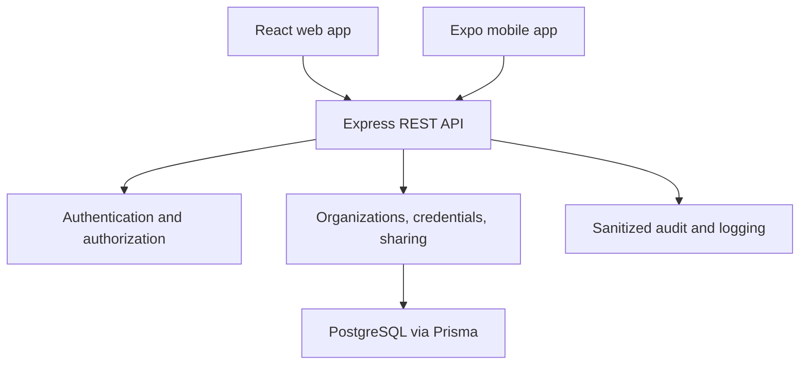

# VerifiedDoc Final Product Handoff

## 1. Product definition

VerifiedDoc is an employer and organization credential verification platform.
Approved organizations create structured credential records for registered
holders. Holders decide what to disclose through limited share links. Employers
and other verifiers confirm the live issuer-backed record before making their
own independent decision.

VerifiedDoc does not inspect uploaded documents with AI, issue credentials on
behalf of institutions, or decide whether a candidate should be hired. The
issuing organization remains the source of truth.

## 2. Completed MVP

| Capability | API | Web | Mobile |
| --- | --- | --- | --- |
| Registration and login | Complete | Connected | Login connected |
| Platform and organization roles | Complete | Role workspaces | Holder scope |
| Organization application and review | Complete | Demonstration workspace | Not in holder app |
| Member invitations and management | Complete | Demonstration workspace | Not in holder app |
| Credential issuance and revocation | Complete | Demonstration workspace | Read-only holder wallet |
| Holder credential wallet | Complete | Demonstration workspace | Connected |
| Consent-based share links | Complete | Demonstration workflow | Demonstration workflow |
| Public verification | Complete | Connected | Connected with QR scanner |
| Organization and platform audit logs | Complete | Demonstration workspace | Not applicable |
| Health, readiness, seed, and admin bootstrap | Complete | Status workspace | Not applicable |
| Shared safe response contracts | Complete | Used | Used |

The web and mobile clients include fictional interactive data so Product,
Design, Frontend, Mobile, QA, and stakeholders can review the complete
experience without collecting real data. Authentication, public verification,
and the mobile holder wallet have direct API integration points. Remaining
operational client mutations are isolated behind the client API layer and can
be connected without changing backend rules.

## 3. Architecture



### Repository boundaries

| Path | Owner | What belongs here |
| --- | --- | --- |
| `apps/api` | Backend | Routes, authorization, services, migrations, audit, OpenAPI |
| `apps/web` | Frontend and UI/UX | Responsive pages, workspaces, forms, client API calls |
| `apps/mobile` | Mobile and UI/UX | Holder wallet, QR sharing, scanning, secure session |
| `packages/contracts` | Backend plus client leads | Safe API request and response shapes |
| `docs` | Product, technical writing, and all leads | Product truth, integration, demo, handoff |

## 4. Security rules that must not be weakened

1. Platform roles and organization membership roles are separate.
2. Only approved organizations can issue credentials.
3. Every tenant query must be scoped by organization membership.
4. Raw refresh, share, and invitation tokens are shown only when required and
   are stored hashed.
5. Public verification returns only holder-approved fields.
6. Unknown, expired, revoked, and exhausted links use a generic unavailable
   response.
7. Passwords, tokens, hashes, cookies, and authorization headers must not enter
   logs or audit responses.
8. Issuance, revocation, organization review, invitations, and member changes
   remain auditable.
9. Development and presentations use fictional `@example.test` data only.
10. Database changes require a new migration. Never edit an applied migration.

## 5. Screen map

### Public web

- Landing and product explanation
- Public credential verification
- Sign in and registration
- Invitation acceptance

### Holder

- Credential wallet
- Credential detail and lifecycle status
- Consent and disclosure controls
- Share-link history
- Profile

### Issuing organization

- Organization overview
- Credential registry
- Credential issuance form
- Members and roles
- Invitations
- Organization audit log

### Verifier

- Token-based verification
- Verification-result guidance

### Platform administrator

- Pending organization review
- Approve or reject decision
- Platform audit log
- System readiness

### Mobile holder app

- Secure sign in
- Wallet and credential detail
- Consent sharing and QR display
- QR scanning and manual verification
- Profile and sign out

## 6. Local run order

1. Install dependencies with `npm install`.
2. Copy `apps/api/.env.example` to `apps/api/.env`.
3. Start PostgreSQL and apply all migrations.
4. Generate Prisma Client.
5. Start the API.
6. Start the web client.
7. Start Expo for mobile testing.

```bash
npm run db:generate --workspace=@verifieddoc/api
npx prisma migrate deploy --schema=apps/api/prisma/schema.prisma
npm run dev:api
npm run dev:web
npm run dev:mobile
```

Run each development server in its own terminal.

## 7. Quality gate

Before opening a pull request:

```bash
npm run lint
npm run typecheck
npm test
npm run build
git diff --check
```

Backend tests require the PostgreSQL test database. CI provisions PostgreSQL,
applies migrations, and runs the complete monorepo gate.

### Manual acceptance checklist

- A holder cannot access another holder's credential.
- An organization member cannot access another organization.
- A platform administrator without membership cannot issue a credential.
- A pending or rejected organization cannot issue.
- Revoked and expired credential states display correctly.
- A share link reveals only selected claims.
- A revoked, expired, exhausted, or unknown share link is generically
  unavailable.
- Invitation tokens are removed from browser history before API submission.
- Responsive layouts work at phone, tablet, and desktop widths.
- QR scanning has a manual-token fallback.
- No real personal data is used in screenshots or demonstrations.

## 8. How each team should contribute

### Product management

- Keep the PRD aligned to the implemented MVP table.
- Record new ideas as follow-up issues instead of changing the release silently.
- Define acceptance criteria and presentation order.

### UI/UX design

- Work from the current page and state map.
- Update typography, spacing, icons, empty states, and accessibility guidance.
- Preserve security language and generic failure states.
- Supply responsive designs for desktop, tablet, and mobile.

### Frontend

- Make visual changes only in `apps/web`.
- Add operational API calls in `apps/web/src/lib/api.ts`.
- Import safe types from `@verifieddoc/contracts`.
- Never copy database or secret-bearing types into the browser.

### Mobile

- Make mobile changes only in `apps/mobile`.
- Keep tokens in Expo Secure Store.
- Preserve camera permission fallback and manual verification.
- Connect share-link creation through `apps/mobile/src/api.ts`.

### Backend

- Own `apps/api`, migrations, authorization, OpenAPI, and audit rules.
- Review contract changes that expose new fields.
- Reject client requests that attempt to bypass organization membership.

### QA

- Test the role and tenant boundaries before visual polish.
- Use separate fictional accounts and organizations.
- Test concurrency for refresh, duplicate registration, review, issuance,
  revocation, invitations, and final share-link views.

### Technical writing

- Keep README, API integration, demo script, and PRD terminology consistent.
- Use “issuer-backed credential verification,” not AI document inspection.

## 9. Git workflow

1. Pull `develop`.
2. Create a narrow branch such as `design/holder-wallet` or
   `feature/web-share-links`.
3. Change only the responsible workspace unless a contract update is approved.
4. Run the quality gate.
5. Open a pull request into `develop`.
6. Request the relevant code owner and resolve all conversations.
7. Promote tested releases from `develop` to `main`.

Do not push directly to protected branches. Do not force-push shared branches.

## 10. Deferred items

The following are not required for the current capstone release:

- OCR or AI document inspection
- External WAEC, NYSC, university, or government integrations
- Automated email delivery
- Password recovery
- Downloadable verification reports
- Advanced analytics
- Production bot protection
- Production app-store signing and release automation

These items require external services, partnerships, additional privacy work, or
more delivery time. They should not block the demonstrated MVP.
